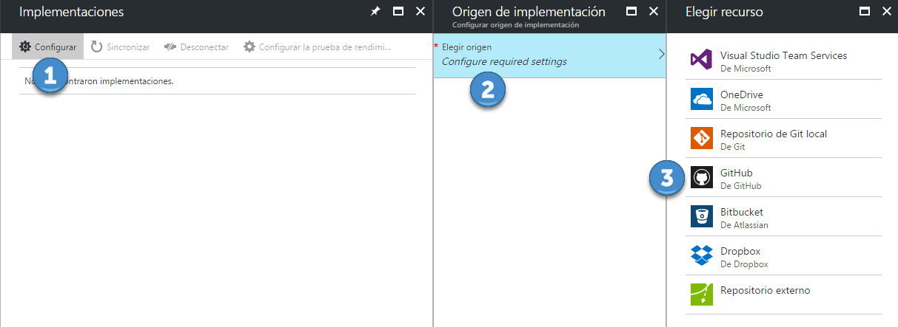

# Configurando deployment continuo en las Azure Functions

Una de las opciones interesantes dentro de lo que son las Azure Functions es la posibilidad de aplicar integración continua. Esto implica que ante cada *push* que se haga sobre nuestro repositorio Azure capture dichos cambios, los compile y si todo funciona de forma correcta los publique.

Las alternativas disponibles que tenemos son las siguientes:

#### Usar un repositorio git interno dentro de la misma Azure Function
Esta alternativa es realmente interesante, ya que está todo integrado dentro de la misma aplicación.

#### Usar un repositorio externo, el cual se puede integrar en el portal
Lo que deberemos hacer en este caso es inicializar el repositorio bajando el código generado en Azure por FTP y luego subirlo al repositorio que decidamos usar. Una vez finalizado eso iremos al portal de Azure y configuraremos en la opción de **_Deployment source_** el repositorio en cuestión.

